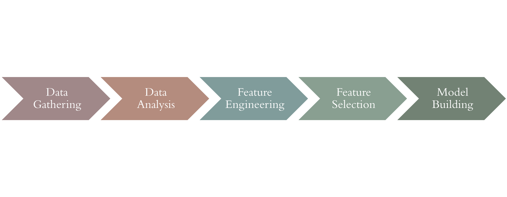
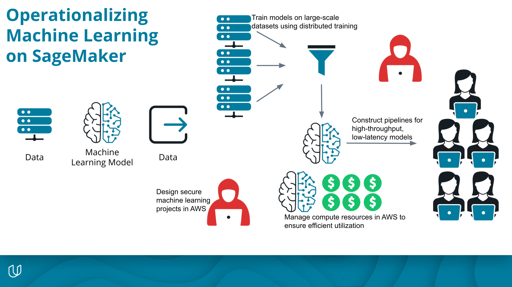
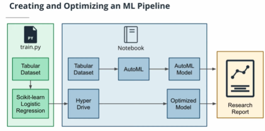
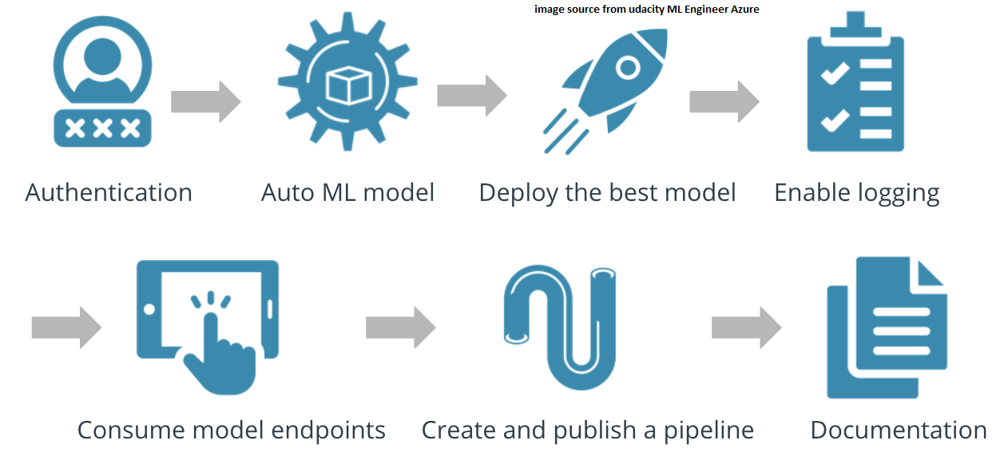
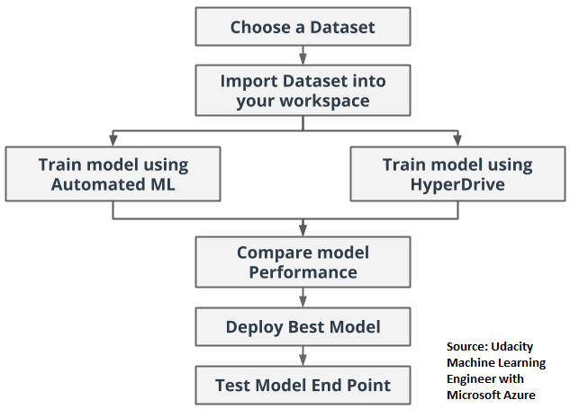

# About me

Software Engineer & DevOps Specialist with 4+ years of experience building and scaling backend services and cloud infrastructure. At Paessler GmbH, developed microservice-based monitoring applications using Python and TypeScript/Node.js, while implementing comprehensive CI/CD pipelines with Docker, Kubernetes, Helm, and GitLab. Expert in AWS  and Azure infrastructure automation using Ansible and Terraform, with proven ability to extract and analyze complex data from systems like Splunk, Prometheus, Grafana and ClickHouse. I also have knowledge of Java and Spring Boot through dedicated project work. Recognized for exceptional analytical problem-solving, independently delivering high-quality solutions, and demonstrating resilience in high-pressure situations. Strong foundation in data engineering, infrastructure-as-code, and full-stack development, with additional expertise in machine learning operations and cloud deployments across AWS and Azure platforms.

[contact me](https://www.linkedin.com/in/diego-arinze-uchendu-1970188b/)

# Projects

# [1 Task Manager_DevOps_Lifecycle](https://gitlab.com/aduzona/diego-task-manager)

A **production-ready Kanban board** with microservices architecture, deployed on **Azure Kubernetes Service (AKS)**. This project demonstrates the complete DevOps lifecycle.

---

## Table of Contents

- [Project Overview](#-project-overview)
- [Live Demo](#-live-demo)
- [Architecture](#-architecture)
- [Tech Stack](#-tech-stack)
- [Project Structure](#-project-structure)
- [Deployment Order](#-deployment-order)
- [Getting Started](#-getting-started)
- [Commands](#-commands)

---

## Project Overview

Diego Task Manager is a Kanban-style task management application that demonstrates the following DevOps practices:

- **Infrastructure as Code** with Terraform
- **Containerization** with Docker
- **Container Orchestration** with Azure Kubernetes Service
- **Package Management** with Helm
- **CI/CD Automation** with GitLab
- **Monitoring** with Prometheus & Grafana

---

## Live Demo

> **Note:** The live demo runs on Azure AKS and is activated on demand.
> For access to the live demo, please contact me directly.

| Service | Description |
|---------|-------------|
| **Application** | Kanban board with drag & drop |
| **Grafana Dashboard** | Real-time monitoring of microservices |
| **GitLab Repository** | https://gitlab.com/aduzona/diego-task-manager |

---

## Architecture

```
┌─────────────────────────────────────────────────────────────────────────────────┐
│                                 INTERNET                                         │
│                                     │                                            │
│                                     ▼                                            │
│                    ┌────────────────────────────────┐                           │
│                    │     Azure Load Balancer        │                           │
│                    │         Public IP              │                           │
│                    └────────────────┬───────────────┘                           │
│                                     │                                            │
│                                     ▼                                            │
│  ┌──────────────────────────────────────────────────────────────────────────┐  │
│  │                      NGINX INGRESS CONTROLLER                             │  │
│  │               Path-based Routing: /api/* vs /*                           │  │
│  └───────────────────────────┬──────────────────────┬───────────────────────┘  │
│                              │                      │                           │
│               /api/*         │                      │  /*                       │
│                              ▼                      ▼                           │
│  ┌─────────────────────────────────┐  ┌─────────────────────────────────────┐     │
│  │      API GATEWAY (Node.js)      │  │      FRONTEND (Next.js)         │     │
│  │      Express + Rate Limiting    │  │      React + Tailwind CSS       │     │
│  │           Port: 4000            │  │          Port: 3000             │     │
│  │          Replicas: 2            │  │          Replicas: 2            │     │
│  └───────────────┬─────────────────┘  └─────────────────────────────────┘     │
│                  │                                                              │
│                  ▼                                                              │
│  ┌─────────────────────────────────┐  ┌─────────────────────────────────┐     │
│  │   TASK SERVICE (Python Flask)   │  │      POSTGRESQL (Database)      │     │
│  │    CRUD Operations + Metrics    │  │  Persistent Volume (Azure Disk) │     │
│  │         Port: 5000              │──▶│         Port: 5432              │     │
│  │          Replicas: 2            │  │          Replicas: 1            │     │
│  └─────────────────────────────────┘  └─────────────────────────────────┘     │
│                                                                                  │
│  ┌──────────────────────────────────────────────────────────────────────────┐  │
│  │                          MONITORING STACK                                 │  │
│  │    Prometheus (collects /metrics) ──▶ Grafana (visualizes dashboards)   │  │
│  │    kube-state-metrics                                                    │  │
│  └──────────────────────────────────────────────────────────────────────────┘  │
└─────────────────────────────────────────────────────────────────────────────────┘
```

---

### Tech Stack

#### Cloud & Infrastructure
| Technology | Description |
|------------|-------------|
| **Azure AKS** | Managed Kubernetes service |
| **Azure ACR** | Container Registry for Docker images |
| **Azure Key Vault** | Secure storage for secrets |
| **Terraform** | Infrastructure as Code |

#### Application & Containers
| Technology | Description |
|------------|-------------|
| **Docker** | Containerization of microservices |
| **Helm** | Kubernetes package management |
| **Python Flask** | Backend Task Service |
| **Node.js Express** | API Gateway |
| **Next.js React** | Frontend user interface |
| **PostgreSQL** | Relational database |

#### CI/CD & Monitoring
| Technology | Description |
|------------|-------------|
| **GitLab CI/CD** | Automated build and deploy pipeline |
| **Prometheus** | Metrics collection |
| **Grafana** | Monitoring dashboards |


## [2_Supply Chain Inventory Tracker](https://gitlab.com/aduzona/supply-chain-tracker)

A full-stack microservices application for tracking inventory across multiple warehouses. Built with modern technologies including Next.js, Node.js, Python Flask, PostgreSQL, and Docker.

### Architecture
```
┌──────────────────┐
│     Frontend     │  Next.js 15 + TypeScript + React
│     :3000        │  Dashboard, Products, Warehouses, Analytics
└────────┬─────────┘
         │
         ▼
┌──────────────────┐     ┌──────────────────┐
│    Inventory     │────▶│    PostgreSQL    │
│     Service      │     │     Database     │
│     :3001        │     │     :5433        │
└────────┬─────────┘     └──────────────────┘
         │
         ▼
┌──────────────────┐
│    Analytics     │  Python Flask
│     Service      │  Aggregates inventory data
│     :5000        │
└──────────────────┘
```

### Technologies

| Layer | Technology |
|-------|------------|
| Frontend | Next.js 15, React, TypeScript, Tailwind CSS |
| Backend API | Node.js, Express, TypeScript |
| Analytics | Python, Flask |
| Database | PostgreSQL 15 |
| ORM | Prisma 5 |
| Containerization | Docker, Docker Compose |
| CI/CD | GitLab CI/CD |

### Features

- **Dashboard**: Overview of inventory statistics and low stock alerts
- **Products Management**: Full CRUD operations for products
- **Warehouse Management**: Track multiple warehouse locations
- **Analytics**: Stock summaries, low stock alerts, inventory health metrics
- **Real-time Data**: All data persisted in PostgreSQL database
- **CI/CD Pipeline**: Automated linting, testing, and Docker builds


## [3_Payslip Extraction Service Next.js_Node.js_Typescript_Azure OpenAI](https://gitlab.com/aduzona/payslip-extraction-service)

A secure, scalable payslip extraction system using **AI (Azure OpenAI GPT-4)** to automatically extract structured data from German payslip PDFs.

### Overview

**Technologies:**

- **Frontend:** Next.js, React, TypeScript, Tailwind CSS
- **Backend:** Node.js, Express, TypeScript
- **Authentication:** Microsoft Entra ID (OAuth 2.0)
- **AI:** Azure OpenAI GPT-4
- **Storage:** Azure Blob Storage
- **Database:** Azure Cosmos DB (NoSQL)
- **Secrets:** Azure Key Vault
- **Deployment:** Docker, Azure Container Apps
- **Infrastructure as a Code:** Terraform

**Key Features:**

* **Secure Authentication** - Microsoft login (SSO)  
* **AI-Powered Extraction** - GPT-4 understands German payslips  
* **Complete Audit Trail** - Every action logged  
* **Scalable Architecture** - Handles 1-1000+ users  
  *  **Role-Based Access** - User permissions  
  * **Persistent Storage** - PDFs in Blob Storage, data in Cosmos DB
 

**Architecture Requirements**

|Requirement| Implementation|Status|
|----------|---------------|------|
|Multiple containers| Web UI + Extraction Service + Cosmos DB| Met|
|All TypeScript| Both services 100% TypeScript| Met| 
| Data schema defined| Complete payslip schema in `types/payslip.types.ts`| Met| 
| Structured Output| Azure OpenAI GPT-4 with JSON |Met|

**Authentication / SSO Requirements**

|Requirement| Implementation|Status|
|----------|---------------|------|
| OpenID Connect| Implemented via MSAL library|Met|
|Azure Entra ID| Full integration with token validation | Met| 
| UI enforces auth| Protected routes with `ProtectedRoute` component|Met| 
| API enforces auth| JWT validation middleware| Met| 
| Identity propagation| JWT passed service-to-service, user info in headers| Met|

**Local Dev & Orchestration Requirements**

| Requirement | Implementation | Status |
|-------------|----------------|--------|
| **docker-compose** | `docker-compose.yml` with all services | Met |
| **Single command** | `docker-compose up` | Met |
| **Sample data** | Included German payslip PDF | Met |


**Cloud Deployment (Azure) Requirements**

| Requirement | Implementation | Status |
|-------------|----------------|--------|
| **Terraform** | Complete infrastructure as code in `infrastructure/terraform/` | Met |
| **One command deploy** | `./deploy.sh` script (build -> push -> deploy) | Met |
| **Secrets via Key Vault** | Most secrets stored in Azure Key Vault | Met |


**Functionality Requirements**

|Requirement | Implementation | Status|
|-------------|----------------|--------|
|Minimal UI: secure login| Microsoft Entra ID login with AuthButton component|  Met|
| Minimal UI: view payslips| Upload form with `UploadForm.tsx` component| Met| 
| Minimal UI: view structured JSON| Display component `PayslipDisplay.tsx` with formatted data|  Met| 
|Minimal API: secure endpoints| `POST /api/extract`, GET `/api/files/*` with JWT validation| Met | 
| Minimal API: structured data| Returns `PayslipData` interface with all fields |Met|
| Input validation & error handling| File type/size validation, try-catch blocks, error messages| Met|


**Other Requirements**

| Requirement|Implementation|Status|
|-----------|---------------|------|
|Diagrams| Multiple architecture diagrams provided using Google diagrams|Met| 
|Schema decision| German payslip schema with justification|Met|
|Database choice| Cosmos DB (NoSQL) with justification| Met| 
| Azure services| Azure services with justification|Met|


**Azure Services Selction**

|Service| Justification| 
|---|-------|
| Container Apps| Serverless containers, simple deployment for this time period| 
| Container Registry| It is azure's main registry for containers| 
| Cosmos DB| This supports the JSON structured schema and its fast| 
| Blob Storage| Cost-effective file storage as I use PDF| 
| Key Vault| Centralized secrets management | 
| Azure OpenAI| GPT-4o supports German language| 


## [4_Build_and_deploy_end_to_en_Spring_boot_Angular_Microservices](https://github.com/Aduzona/1_Build_and_deploy_end_to_end)

### Introduction

This project demonstrates the creation, deployment, and testing of a microservices-based application using several modern development and deployment tools. The application consists of a **Restaurant Listing** microservice, **User** Microservice, **Food Catalogue** Microservice, **Order** Microservice and an **Eureka server** for service discovery. The project uses Spring Boot for building the services, MySQL as the database, and various cloud-native and DevOps tools for deployment.

Also Included is Frontend Angular and Typescript

### Building Backend Microservice Application

* Set Up Eureka Server First.
  * Use Spring Initializr
  * Dependencies
    * Eureka Server
* Then Create Restaurant Listing Microservices:
  * mapstruct used to map your entities to DTOs and DTOs to entities because in real world you will never play with entities.
  * Use spring initializr
  * Dependencies:
    * Spring Web
    * Lombak
    * Spring Data JPA
    * MySQL Driver
    * Eureka Discovery Client
    * We will add mapstruct manually.

## [5_Angular_Frontend and Springboot Backend GitLab CICD, EKS](https://gitlab.com/aduzona/webapps_cicd_aws)


### **Application Overview**

This is a small application where users can add, update, and delete car brands. It uses an **Angular** frontend and a **Spring Boot** backend, demonstrating **DevOps principles** with **GitLab**. However, the GitLab CI pipeline is currently non-functional due to disconnection.

---

### **Technologies Used**
- **Frontend**: Angular  
- **Backend**: Spring Boot  
- **Containerization**: Docker  
- **Orchestration**: Kubernetes  
- **Version Control & CI/CD**: GitLab CI, GitLab Container Registry  
- **Cloud Services**: AWS EKS (Elastic Kubernetes Service), AWS ECR (Elastic Container Registry)  
- **Other Tools**: GitLab, ECR  
- **Additional Technologies**: etc.


## [6_Build the Backend System for a Car Website(click)](https://github.com/Aduzona/nd035-C2-Web-Services-and-APIs-Exercises-and-Project-Starter)

In this project, I used my skills with Spring Boot, APIs, documentation, and testing to implement a Vehicles API that serves as an endpoint to track vehicle inventory. While the primary Vehicles API will perform CRUD operations (Create, Read, Update and Delete) related to vehicle details like make, model, color, etc., it will need to consume data from other APIs as well regarding location and pricing data. You will implement a RESTful API for the Vehicles API, as well as converting a Pricing Service API to a microservice.

By the end of this project, you'll have an application that can communicate with other services and be able to be viewed and used through Swagger-based API documentation.

I used Intellij, and I prefare that each of the microservice are opened in separate intellij IDE.

Microservices

* Location Service Code
* Price Service Code
* Vehicles API Code

For more details, visit [Build the Backend System for a Car Website](https://github.com/Aduzona/nd035-C2-Web-Services-and-APIs-Exercises-and-Project-Starter)

## [7_CI_CD_ML_Model_Deployment_using_Flask_and_Docker(click)](https://github.com/Aduzona/CI_CD_ML_Model_Deployment_using_Flask_and_Docker/tree/master)




After model training, model should be saved.

But in production environment this processes should occur,

* Live Data
* Feature Engineering
* Feature Selection
* Model Prediction: No model building here, we will use same model we built to make predicition.
* Prediction

We will be using joblib library to save the model, then we will be using the saved model to deploy it using flask. We will create an API then we will deploy it using Docker.


## [8_Operationalizing an AWS Machine Learning(click)](https://github.com/Aduzona/AWS_Operationalize_ML_Project)



[source Udacity](https://www.udacity.com/course/aws-machine-learning-engineer-nanodegree--nd189)

In this project, I completed the following steps:

1. Train and deploy a model on Sagemaker, using the most appropriate instances. Set up multi-instance training in Sagemaker notebook.
2. Adjusted Sagemaker notebooks to perform training and deployment on EC2.
3. Set up a Lambda function for deployed model. Set up auto-scaling for my deployed endpoint as well as concurrency for my Lambda function.
4. Ensured that the security on my ML pipeline is set up properly.

[click her for more](https://github.com/Aduzona/AWS_Operationalize_ML_Project)


## [9_Build_Deploy and Monitor a Machine Learning workflow for Image Classification(click)](https://github.com/Aduzona/AWS-Machine-Learning-Workflow-Project)

In this project, you'll be building an image classification model that can automatically detect which kind of vehicle delivery drivers have, in order to route them to the correct loading bay and orders. Assigning delivery professionals who have a bicycle to nearby orders and giving motorcyclists orders that are farther can help Scones Unlimited optimize their operations.

As an MLE, your goal is to ship a scalable and safe model. Once your model becomes available to other teams on-demand, it’s important that your model can scale to meet demand, and that safeguards are in place to monitor and control for drift or degraded performance.

In this project, you’ll use AWS Sagemaker to build an image classification model that can tell bicycles apart from motorcycles. You'll deploy your model, use AWS Lambda functions to build supporting services, and AWS Step Functions to compose your model and services into an event-driven application. At the end of this project, you will have created a portfolio-ready demo that showcases your ability to build and compose scalable, ML-enabled, AWS applications.

**Project Steps Overview**

<ol>
    <li>Step 1: Data staging</li>
    <li> Step 2: Model training and deployment</li>
    <li> Step 3: Lambdas and step function workflow</li>
    <li> Step 4: Testing and evaluation</li>
    <li> Step 5: Optional challenge</li>
    <li> Step 6: Cleanup cloud resources</li>
</ol>

## [10_Operationalizing Machine Learning (click)](https://github.com/Aduzona/Microsoft-Azure-ML-Projects/blob/master/1_Optimizing_an_ML_Pipeline_in_Azure)


[Image source](udacity.com)

In this project, I built and optimize an Azure ML pipeline using the Python SDK and a provided Scikit-learn model. This model is then compared to an Azure AutoML run.

We seek to create and optimize an ML Pipeline using Bank Marketing dataset by:

* Optimize custom mdel with HyperDrive
* Optimize using Automated machine learning(AutoML)
And Compare the results of the 2 methods

## [11_Machine Learning Operations (MLOps)(click)](https://github.com/Aduzona/Microsoft-Azure-ML-Projects/tree/master/2_Operationalizing_Machine_Learning)


The Architectural Diagram provided above starts from Authentication and ends with Documentation.

[Watch Project Demo](https://youtu.be/7dhdi-XTauE)

This Project aimed at Operationalizing Machine Learning, by applying DevOps principles to Machine Learning, usually known as MLOPs. I will start by creating an ML model from the Bank Marketing dataset, from there I deploy the model, consume endpoint it and pipeline automation. it. 


## [12_Predicting mortality by heart failure using Microsoft Azure (click)](https://github.com/Aduzona/Microsoft-Azure-ML-Projects/tree/master/3_Capstone_Project_Azure_ML_Engineer)



[Watch_Project_Demo](https://youtu.be/FyO7d5RUqPw)

I will start by getting the Heart failure dataset into Azure datastore, then create 2 models, one using AutoML and the other using HyperDrive,Compare there performance, Deploy Best Model and Test Model End Point.


## [Find Donor](https://github.com/Aduzona/Machine_Learning_Projects/tree/master/finding_donors)

### Supervised Learning
#### Project: Finding Donors for CharityML
[code](https://github.com/Aduzona/Machine_Learning_Projects/blob/master/finding_donors/finding_donors.ipynb)
#### Data

The modified census dataset consists of approximately 32,000 data points, with each datapoint having 13 features. This dataset is a modified version of the dataset published in the paper *"Scaling Up the Accuracy of Naive-Bayes Classifiers: a Decision-Tree Hybrid",* by Ron Kohavi. You may find this paper [online](https://www.aaai.org/Papers/KDD/1996/KDD96-033.pdf), with the original dataset hosted on [UCI](https://archive.ics.uci.edu/ml/datasets/Census+Income).

**Features**
- `age`: Age
- `workclass`: Working Class (Private, Self-emp-not-inc, Self-emp-inc, Federal-gov, Local-gov, State-gov, Without-pay, Never-worked)
- `education_level`: Level of Education (Bachelors, Some-college, 11th, HS-grad, Prof-school, Assoc-acdm, Assoc-voc, 9th, 7th-8th, 12th, Masters, 1st-4th, 10th, Doctorate, 5th-6th, Preschool)
- `education-num`: Number of educational years completed
- `marital-status`: Marital status (Married-civ-spouse, Divorced, Never-married, Separated, Widowed, Married-spouse-absent, Married-AF-spouse)
- `occupation`: Work Occupation (Tech-support, Craft-repair, Other-service, Sales, Exec-managerial, Prof-specialty, Handlers-cleaners, Machine-op-inspct, Adm-clerical, Farming-fishing, Transport-moving, Priv-house-serv, Protective-serv, Armed-Forces)
- `relationship`: Relationship Status (Wife, Own-child, Husband, Not-in-family, Other-relative, Unmarried)
- `race`: Race (White, Asian-Pac-Islander, Amer-Indian-Eskimo, Other, Black)
- `sex`: Sex (Female, Male)
- `capital-gain`: Monetary Capital Gains
- `capital-loss`: Monetary Capital Losses
- `hours-per-week`: Average Hours Per Week Worked
- `native-country`: Native Country (United-States, Cambodia, England, Puerto-Rico, Canada, Germany, Outlying-US(Guam-USVI-etc), India, Japan, Greece, South, China, Cuba, Iran, Honduras, Philippines, Italy, Poland, Jamaica, Vietnam, Mexico, Portugal, Ireland, France, Dominican-Republic, Laos, Ecuador, Taiwan, Haiti, Columbia, Hungary, Guatemala, Nicaragua, Scotland, Thailand, Yugoslavia, El-Salvador, Trinadad&Tobago, Peru, Hong, Holand-Netherlands)

**Target Variable**
- `income`: Income Class (<=50K, >50K)


## [image_classifier_with_tensorflow](https://github.com/Aduzona/image_classifier_with_tensorflow)

In this udacity project, I developed code for an image classifier built with TensorFlow, then you will convert it into a command line application.

In order to complete this project, you will need to use the GPU enabled workspaces within the classroom. The files are all available here for your convenience, but running on your local CPU will likely not work well.

You should also only enable the GPU when you need it. If you are not using the GPU, please disable it so you do not run out of time!

[code](https://github.com/Aduzona/image_classifier_with_tensorflow/blob/master/Project_Image_Classifier_Project.ipynb)

### Data

The data for this project is quite large - in fact, it is so large you cannot upload it onto Github. If you would like the data for this project, you will want download it from the workspace in the classroom. Though actually completing the project is likely not possible on your local unless you have a GPU. You will be training using 102 different types of flowers, where there ~20 images per flower to train on. Then you will use your trained classifier to see if you can predict the type for new images of the flowers.
